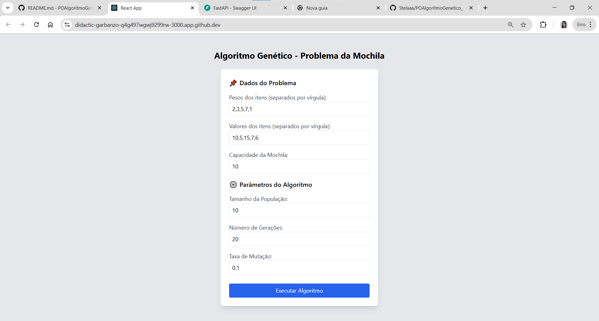

# POAlgoritmoGenetico_

Aplicação feita em github codespaces

### para iniciar o backend:
        cd backend
        lsof -i :8000
        pkill -f uvicorn
        pip install fastapi uvicorn
        ls -la
        source venv/bin/activate
        uvicorn main:app --host 0.0.0.0 --port 8000 --reload

### para iniciar frontend:
        cd frontend
        npm start

### Visão inicial
